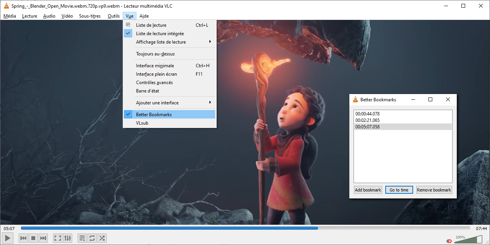

# VLC Lua Extension: Better Bookmarks

## Overview

This VLC Lua extension allows users to create, manage, and navigate video time bookmarks easily. Bookmarks are saved as `.bmk` files alongside the video files, similar to how `.srt` subtitle files are stored. This extension provides a user-friendly interface to append and delete bookmarks, as well as jump to any bookmarked time during video playback.

## Features

- **Create Bookmarks**: Add bookmarks at the current playback time.
- **Delete Bookmarks**: Remove bookmarks from the list.
- **Jump to Bookmarks**: Navigate to any bookmarked time with a simple click.
- **Persistent Storage**: Bookmarks are saved in a `.bmk` file next to the video file (e.g., `video.mp4` will have its bookmarks saved in `video.mp4.bmk`).



## Installation

1. **Download the Extension**: Download the `better_bookmarks.lua` file from the repository.
2. **Locate VLC's Lua Extensions Folder**:
   - On Windows: `C:\Users\<UserName>\AppData\Roaming\vlc\lua\extensions` (`%appdata%\VLC\lua\extensions\`)
   - On macOS: `/Users/<UserName>/Library/Application Support/org.videolan.vlc/lua/extensions/`
   - On Linux: `~/.local/share/vlc/lua/extensions/`
3. **Copy the File**: Place the `better_bookmarks.lua` file into the extensions folder.
4. **Restart VLC**: Close and reopen VLC Media Player to load the extension.

## Usage

1. **Open a Video**: Load a video file in VLC.
2. **Access the Extension**: Go to `View` in the menu bar and select `Better Bookmarks`.
3. **Manage Bookmarks**:
   - **Add Bookmark**: Click the "Add Bookmark" button to save the current playback time.
   - **Delete Bookmark**: Select a bookmark from the list and click the "Delete Bookmark" button.
   - **Jump to Bookmark**: Click on any bookmark in the list to jump to that specific time in the video.

## Bookmark File Format

Bookmarks are stored in a simple text format in the `.bmk` file. Each line represents a bookmark with the following structure:

```
[Timestamp in microseconds]
```

Example of a `.bmk` file:

```
44788932
141653712
307581600
```

## Requirements

- VLC Media Player (version 3.0 or later)
- Basic knowledge of Lua (optional, for customization)

## Troubleshooting

- **Extension Not Appearing**: Ensure that the `better_bookmarks.lua` file is in the correct extensions folder and that VLC has been restarted.
- **File Permissions**: Make sure you have the necessary permissions to read/write in the directory where the video and bookmark files are stored.

## Contributing

Contributions are welcome! If you have suggestions for improvements or new features, feel free to open an issue or submit a pull request.

## License

This project is licensed under the MIT License. See the LICENSE file for more details.

## Acknowledgments

- Thanks to the VLC development team for providing a powerful media player and extension framework.
- Special thanks to the Lua community for their support and resources.

## References

share/lua · master · VideoLAN / VLC · GitLab. (2025). GitLab. https://code.videolan.org/videolan/vlc/-/tree/master/share/lua

Wikipedia contributors. (2025, March 9). Spring (2019 film). In Wikipedia, The Free Encyclopedia. Retrieved 08:45, March 21, 2025, from https://en.wikipedia.org/w/index.php?title=Spring_(2019_film)&oldid=1279577693